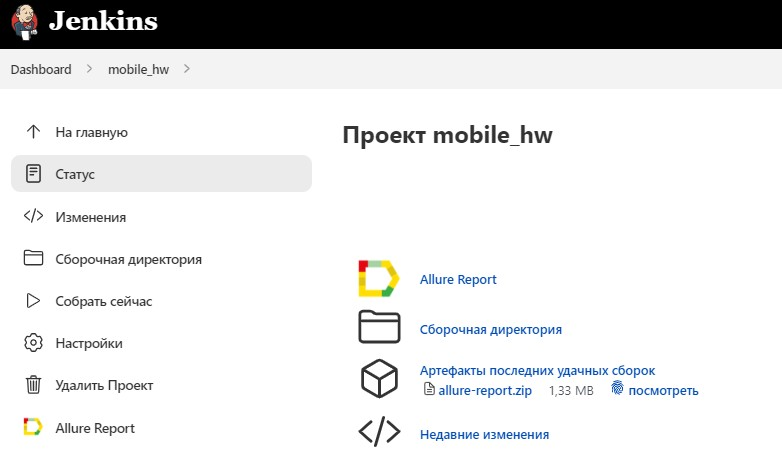
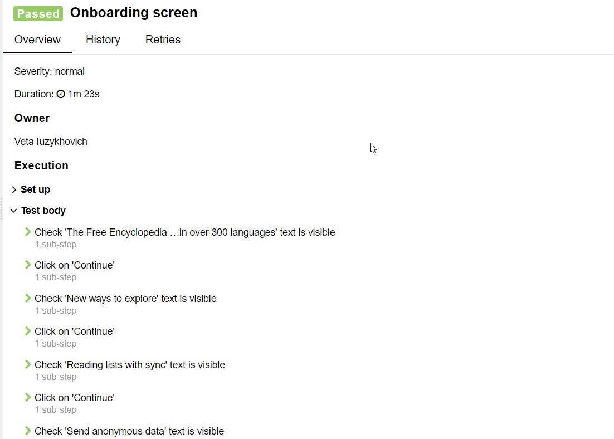

# Automated tests of Wikipedia app

##	Content

- [Tools and technologies](#technologist-технологии-и-инструменты)
- [Implemented tests](#bookmark_tabs-реализованные-проверки)
- [Launch tests with terminal](#computer-запуск-тестов-из-терминала)
- [Launch tests with Jenkins](#-запуск-тестов-в-jenkins)
- [Testing results in Allure Report](#-отчет-о-результатах-тестирования-в-Allure-report)
- [Интеграция с Allure TestOps](#-интеграция-с-allure-testops)
- [Уведомления в Telegram с использованием бота](#-уведомления-в-telegram-с-использованием-бота)
- [Example of test launch with Browserstack](#-пример-запуска-теста-в-Browserstack)

## Tools and Technologies
<p  align="center">

<code></code>
<code></code>
<code></code>
<code></code>
<code></code>
<code></code>
<code></code>
<code></code>
<code></code>

</p>

## Implemented tests:

- Successfull serch of an article in app 
- Verify page conten with required parameters 
- Checking 4 pages content(onBoarding screen)

## Test launching with terminal

### Remote test launching

```bash
gradle clean test 
-DdeviceHost=remote
```

### Local test launching

```bash
gradle clean test
-DdeviceHost=local
```

##  Запуск тестов в [Jenkins](https://jenkins.autotests.cloud/job/mobile_hw/)

To launch test click button <code><strong>*Собрать*</strong></code>.

<p align="left">
  
</p>

After test run block <code><strong>*История сборок*</strong></code> will have logo *Allure Report*, after clicking on it page with html-report open.

##  Tests reault report with [Allure Report](https://jenkins.autotests.cloud/job/mobile_hw/allure/)

<p align="left">
  
</p>


